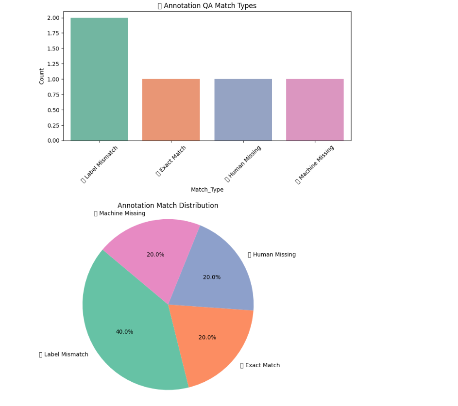

# 🧠 Clinical Annotation QA Toolkit

This project is a Clinical NLP quality assurance (QA) tool for comparing human-annotated entities to machine-generated annotations. It calculates match types, exports results, and visualizes evaluation metrics.

---

## 📌 Project Highlights

- Compare human and machine entity annotations  
- Classify differences:
  - ✅ Exact Match  
  - ❌ Label Mismatch  
  - ❌ Human Missing  
  - ❌ Machine Missing  
- Automatically calculate Precision, Recall, F1-Score  
- Export annotated comparison to CSV  
- Visualize QA results using bar and pie charts  

---

## 📁 Files

| File                             | Description                          |
|----------------------------------|--------------------------------------|
| `annotation_qa_toolkit.ipynb`    | Full evaluation and QA notebook      |
| `annotation_comparison_results.csv` | Merged output with match types     |
| `qa_results_visualization.png`   | Screenshot of evaluation charts      |
| `requirements.txt`               | Required Python packages             |

---

## 🧪 Example Output



---

## 📊 Evaluation Summary (Example)

| Metric    | Value |
|-----------|-------|
| Precision | 1.00  |
| Recall    | 0.33  |
| F1 Score  | 0.50  |

---

## ⚙️ How to Run

Clone the repository:

```bash
git clone https://github.com/samuelnjerungari/clinical-annotation-qa-toolkit.git
cd clinical-annotation-qa-toolkit
```

Install dependencies:

```bash
pip install -r requirements.txt
```

Launch the notebook:

```bash
jupyter notebook annotation_qa_toolkit.ipynb
```

---

## 🛠️ Requirements

See `requirements.txt` for full list. Key libraries include:

- `pandas`  
- `scikit-learn`  
- `matplotlib`  
- `seaborn`  

---

## 👤 Author

**Samuel Njeru Ngari**  

- [🔗 LinkedIn Profile](https://www.linkedin.com/in/samuel-n-ngari)  
- [💻 GitHub Profile](https://github.com/samuelnjerungari)
